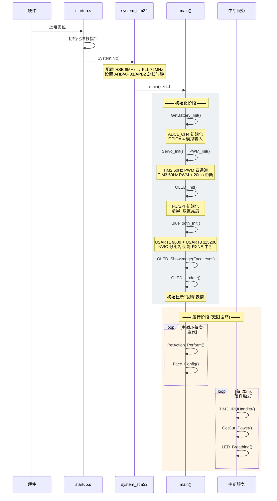
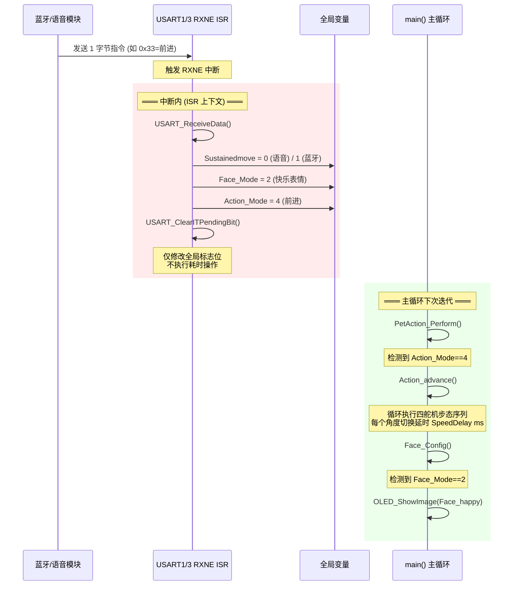

# 🐾 STM32 智能桌面宠物 (Smart Desktop Pet)

> 基于 STM32F103C8T6 的桌面电子宠物机器人 —— 支持蓝牙/语音遥控、OLED 表情显示、四足舵机行走、呼吸灯与电量监测

[](https://www.st.com/en/microcontrollers-microprocessors/stm32f103c8.html)
[](https://www.st.com/en/embedded-software/stm32-standard-peripheral-libraries.html)
[](https://www.keil.com/)
[](#license)
[](https://oshwhub.com/sngelswyh)

---

## 📷 项目简介

这是一个开源的四足桌面宠物机器人项目。它拥有 4 个舵机驱动的腿部关节、1 个独立尾巴舵机、一块 0.96 寸 OLED 显示屏用于展示表情，支持**蓝牙 APP 遥控**和**语音指令控制**，还具备 LED 呼吸灯和电池电量监测功能。外形可爱，适合作为桌面摆件、电子玩具或 STM32 学习项目。

### 🌟 主要特性

- 🤖 **四足行走**：前进、后退、左转、右转、跳跃、摇摆
- 🎭 **7 种 OLED 表情**：眨眼、快乐、狂热、睡觉、瞪眼、打招呼等
- 🦮 **16 种动作模式**：趴下、站立、坐下、伸懒腰、打招呼、摇尾巴等
- 📡 **双通道遥控**：
  - **蓝牙 (USART3, 115200bps)**：支持持续运动模式，App 长按发送
  - **语音模块 (USART1, 9600bps)**：单次触发动作
- 💡 **LED 呼吸灯**：支持常亮、呼吸、关闭三种模式
- 🔋 **电量检测**：实时 ADC 采样 + 100 次滑动平均滤波，可叠加显示在 OLED 上

---

## 🛠️ 硬件架构

### BOM (物料清单)

| 组件 | 型号/规格 | 数量 | 说明 |
|------|----------|------|------|
| 主控 | STM32F103C8T6 | 1 | ARM Cortex-M3, 72MHz |
| 显示屏 | 0.96" OLED 128×64 | 1 | SSD1306 / I²C 或 SPI |
| 舵机 ×5 | SG90 或同类 | 5 | 4 腿 + 1 尾，50Hz PWM |
| 蓝牙模块 | HC-05 / JDY-31 | 1 | 串口透传 |
| 语音模块 | SU-03T 或同类 | 1 | 语音识别 → 串口指令 |
| LED | 贴片 LED ×2 | 2 | PWM 控制亮度 |
| 电池 | 3.7V 锂电池 | 1 | 可通过分压电路检测电量 |

### 舵机布局 (俯视)

```
         前方 →
    ┌─────────────┐
    │    头部     │
    │  Servo1   Servo2  │   ← 前腿
    │  Servo3   Servo4  │   ← 后腿
    │    尾巴     │
    └─────────────┘
```

### 引脚映射

| 外设 | 引脚 | 功能 |
|------|------|------|
| 舵机1 (左前腿) | PA0 (TIM2_CH1) | PWM 输出 |
| 舵机2 (右前腿) | PA1 (TIM2_CH2) | PWM 输出 |
| 舵机3 (左后腿) | PA2 (TIM2_CH3) | PWM 输出 |
| 舵机4 (右后腿) | PA3 (TIM2_CH4) | PWM 输出 |
| 尾巴舵机 | PA6 (TIM3_CH1) | PWM 输出 |
| LED1 | PB0 (TIM3_CH3) | PWM 调光 |
| LED2 | PB1 (TIM3_CH4) | PWM 调光 |
| 语音 RX/TX | PA10 / PA9 (USART1) | 9600bps |
| 蓝牙 RX/TX | PB11 / PB10 (USART3) | 115200bps |
| 电池 ADC | PA4 (ADC1_CH4) | 电量采样 |

---

## 📁 项目结构

```
桌面宠物代码/
├── User/                    # 应用层
│   ├── main.c               # 主程序入口 & TIM3 中断
│   ├── stm32f10x_conf.h     # 外设配置头文件
│   ├── stm32f10x_it.c       # 异常/中断处理模板
│   └── stm32f10x_it.h
├── HardWare/                 # 板级驱动 (BSP)
│   ├── AD.c/h               # ADC 驱动
│   ├── BlueTooth.c/h        # 蓝牙 + 语音 USART 初始化 & 指令解析
│   ├── Delay.c/h            # 微秒/毫秒/秒延时
│   ├── Face_Config.c/h      # 表情切换 & 电量显示
│   ├── Led_Breathing.c/h    # LED 呼吸灯逻辑
│   ├── OLED.c/h             # OLED 显示驱动 (128×64)
│   ├── OLED_Data.c/h        # 汉字字模 & 表情图像数据
│   ├── PetAction.c/h        # 动作控制 (16种动作)
│   ├── PowerDetection.c/h   # 电池电压检测 & 采样滤波
│   ├── PWM.c/h              # PWM 舵机控制 & LED 调光
│   ├── Servo.c/h            # 舵机角度控制封装
│   └── Variable.c/h         # 全局变量定义
├── Library/                  # STM32F10x 标准外设库
├── Start/                    # CMSIS 核心 & 启动文件
├── Objects/                  # 编译输出 (.hex, .axf, .o)
└── Project.uvprojx           # Keil MDK 工程文件
```

---

## 🎮 控制协议

### 串口指令表

指令通过 USART1 (语音) 或 USART3 (蓝牙) 发送，每个指令 **1 字节**。

| 指令 | 动作 | 表情 | 备注 |
|:---:|------|------|------|
| `0x29` | 放松趴下 | 😴 睡觉 | |
| `0x30` | 蹲下 | 😳 瞪眼 | |
| `0x31` | 站立 | 👀 眼睛 | 默认上电状态 |
| `0x32` | 趴下 | 😳 瞪眼 | |
| `0x33` | 前进 | 😊 快乐 | 蓝牙下持续运动 |
| `0x34` | 后退 | 😊 快乐 | 蓝牙下持续运动 |
| `0x35` | 左转 | 😊 快乐 | 蓝牙下持续运动 |
| `0x36` | 右转 | 😊 快乐 | 蓝牙下持续运动 |
| `0x37` | 摇摆 | 😆 非常快乐 | |
| `0x38` | 增加移动速度 | 🔥 狂热 (最快时) | 120→200ms 循环 |
| `0x39` | 增加摇摆速度 | 🔥 狂热 (最快时) | 3→9ms 循环 |
| `0x40` | 切换摇尾巴 | 😳 瞪眼 | 按一下开，再按关 |
| `0x41` | 向前跳 | 😊 快乐 | |
| `0x42` | 向后跳 | 😊 快乐 | |
| `0x43` | 打招呼 (挥手) | 👋 Hello | |
| `0x44` | 灯光全开 | — | |
| `0x45` | 灯光关闭 | — | |
| `0x46` | 呼吸灯开 | — | |
| `0x47` | 呼吸灯关 | — | |
| `0x48` | 伸懒腰 | 👋 Hello | |
| `0x49` | 后腿拉伸 | 👋 Hello | |
| `0x50` | 切换电量显示 | — | OLED 左上角叠加 |

### 双通道行为差异

| 特性 | 语音 (USART1) | 蓝牙 (USART3) |
|------|:---:|:---:|
| 波特率 | 9600 | 115200 |
| 持续运动 | ❌ 单次执行 | ✅ 按住持续执行 |
| 适用场景 | 语音指令 | App 遥控手柄 |

---

## 🔧 软件开发

### 环境要求

- **IDE**: Keil MDK-ARM V5 或更高
- **编译器**: ARMCC V5 / V6
- **下载器**: ST-Link / J-Link / DAP-Link
- **库依赖**: STM32F10x 标准外设库 V3.5.0 (已包含在 `Library/` 中)

### 编译 & 烧录

1. 用 Keil MDK 打开 `Project.uvprojx`
2. 选择 Target: `STM32F103C8`
3. 点击 **Build (F7)** 编译
4. 使用 ST-Link 连接开发板
5. 点击 **Download (F8)** 烧录

编译产物：`Objects/Project.hex`

### 代码配置

在 [Variable.h](HardWare/Variable.h) 和 [Variable.c](HardWare/Variable.c) 中可以调整：

```c
#define Chongfunumber 2         // 移动类动作的重复次数
#define SwingRepeatnumber 3     // 摇摆重复次数
#define HelloRepeatnumber 4     // 打招呼重复次数

uint16_t SpeedDelay = 200;     // 运动速度 (ms), 越小越快
uint16_t SwingDelay = 6;       // 摇摆速度 (ms), 越小越快
```

---

## ⚙️ 技术细节

### 舵机控制

- PWM 频率：**50Hz** (周期 20ms)
- 角度映射公式：`CCR = Angle / 180 × 2000 + 500`
- 有效脉冲范围：500 ~ 2500 μs (对应 0° ~ 180°)

### 电量检测

- ADC 采样通道：PA4 (ADC1_CH4)
- 采样分辨率：12-bit (0 ~ 4095)
- 电压计算：`V_bat = (3.3 × 4 × ADC_Value / 4096) × 100 - 300`
- 滤波算法：**100 次滑动平均**
- TIM3 每 20ms 中断采样一次，100 次（2s）后输出一次结果

### 呼吸灯

- PWM 驱动 LED (PB0/PB1)
- 三阶段循环：
  1. **渐亮**：占空比从 0 递增至 100%
  2. **渐暗**：占空比从 100% 递减至 0%
  3. **等待**：短暂延时后重启循环
- 20ms 步进 100 单位，从 0 到 20000 共 200 步 ≈ 4 秒/周期

### 系统时序

```
main() 循环:
  ┌─ PetAction_Perform()   ← 依据 Action_Mode 执行动作
  └─ Face_Config()         ← 刷新 OLED 表情 + 电量

TIM3 中断 (每 20ms):
  ├─ GetCur_Power()        ← ADC 电量采样
  └─ LED_Breathing()       ← 呼吸灯状态更新
```

---

## ⏱️ 程序时序链

### 一、上电启动时序



### 二、主循环完整调用链

```
┌─────────────────────────────────────────────────────────────────┐
│                      main() while(1)                            │
│                                                                 │
│  ┌─────────────────────────────┐    ┌─────────────────────────┐ │
│  │   PetAction_Perform()       │───▶│   Face_Config()         │ │
│  │   依据 Action_Mode 路由:     │    │   依据 Face_Mode 切换:   │ │
│  │                             │    │                         │ │
│  │  Mode=0 → relax_getdowm()   │    │  Face=0 → Face_sleep    │ │
│  │  Mode=1 → sit()             │    │  Face=1 → Face_stare    │ │
│  │  Mode=2 → upright()         │    │  Face=2 → Face_happy    │ │
│  │  Mode=3 → getdowm()         │    │  Face=3 → Face_mania    │ │
│  │  Mode=4 → advance()         │    │  Face=4 → Face_vhappy   │ │
│  │  Mode=5 → back()            │    │  Face=5 → Face_eyes     │ │
│  │  Mode=6 → Lrotation()       │    │  Face=6 → Face_hello    │ │
│  │  Mode=7 → Rrotation()       │    │                         │ │
│  │  Mode=8 → Swing()           │    │  + 电量叠加显示          │ │
│  │  Mode=9 → SwingTail()       │    │  (Battery_Bit=1时)      │ │
│  │  Mode=10→ JumpU()           │    │                         │ │
│  │  Mode=11→ JumpD()           │    │  OLED_Update()          │ │
│  │  Mode=12→ upright2()        │    └─────────────────────────┘ │
│  │  Mode=13→ Hello()           │                                │
│  │  Mode=14→ stretch()         │                                │
│  │  Mode=15→ Lstretch()        │                                │
│  └─────────────────────────────┘                                │
└─────────────────────────────────────────────────────────────────┘
```

### 三、中断时序详解

```
时间轴 ───────────────────────────────────────────────────────────▶

TIM3 溢出中断 (每 20ms):
┌────┬────┬────┬────┬────┬────┬────┬────┬────┬────┬────┬────┬────┐
│ T=0│ T=1│ T=2│ T=3│ ...│T=99│T=100│T=101│ ...│T=199│T=200│ ...│
└────┴────┴────┴────┴────┴────┴─────┴─────┴────┴─────┴─────┴────┘
  │    │    │    │         │     │      │           │      │
  ▼    ▼    ▼    ▼         ▼     ▼      ▼           ▼      ▼
 ADC  ADC  ADC  ADC      ADC   ADC    ADC         ADC    ADC
采样  采样  采样  采样    采样   采样   采样        采样   采样
  │    │    │    │         │     │      │           │      │
  ▼    ▼    ▼    ▼         ▼     ▼      ▼           ▼      ▼
累加  累加  累加  累加    累加  取平均  累加       累加   取平均
                                │  输出                    │  输出
                                ▼  CurBattery              ▼  CurBattery

呼吸灯 (并行):
  ├── PanDuan=1: HuXi+=100 ──▶ 渐亮 ──▶ 20000时切PanDuan=2
  ├── PanDuan=2: HuXi-=100 ──▶ 渐暗 ──▶ 0时切PanDuan=3
  └── PanDuan=3: Wait+=1000 ─▶ 停顿 ─▶ 20000时切PanDuan=1
```

### 四、USART 串口中断 → 动作响应链



### 五、蓝牙持续运动 vs 语音单次运动

```
蓝牙通道 (USART3, Sustainedmove=1):
  指令 0x33 ──▶ Action_Mode=4 ──▶ Action_advance() 进入 while(Action_Mode==4)
                                       │
                                       ├─ 执行一步 4 舵机序列
                                       ├─ 延时 SpeedDelay ms
                                       ├─ 检查 Action_Mode 是否仍是 4
                                       │    │
                                       │    ├─ 是 ──▶ 循环继续 (无限持续)
                                       │    └─ 否 ──▶ 退出
                                       │
                                       ▼
                              下一条蓝牙指令到达 ──▶ Action_Mode 改变 ──▶ 旧动作退出, 新动作开始

语音通道 (USART1, Sustainedmove=0):
  指令 0x33 ──▶ Action_Mode=4 ──▶ Action_advance() 进入 while(Action_Mode==4)
                                       │
                                       ├─ 执行 Chongfunumber(=2) 次循环
                                       ├─ PAnumbers 递减到 0
                                       ├─ Sustainedmove≠1 ──▶ Action_Mode=2 (站立)
                                       │
                                       ▼
                              自动回到站立 → 等待下一条指令
```

### 六、摇尾巴动作的时序状态机

```
        ┌──────────────────────────────────────────┐
        │            Action_SwingTail()             │
        │                                          │
 入口 ──▶  WeiBa_Bit == 1 ?                       │
        │     │                                    │
        │     ├─ 否 ──▶ 跳过, 直接返回              │
        │     │                                    │
        │     └─ 是 ──▶ WeiBa_Dir == 1 ?           │
        │                │                         │
        │                ├─ 正方向 (1):             │
        │                │  for i=WeiBa_Value→150  │
        │                │    WServo_Angle(i)       │
        │                │    Delay_ms(SwingDelay)  │
        │                │  WeiBa_Dir = 0           │
        │                │                         │
        │                └─ 反方向 (0):             │
        │                   for i=WeiBa_Value→30   │
        │                     WServo_Angle(i)       │
        │                     Delay_ms(SwingDelay)  │
        │                   WeiBa_Dir = 1           │
        │                                          │
        │  每次迭代检查:                            │
        │  ├─ WeiBa_Bit != 1 ──▶ break             │
        │  └─ Action_Mode != 9 ──▶ break           │
        │                                          │
        └── 循环直到 WeiBa_Bit 被 0x40 指令翻转 ──▶ 退出
```

### 七、完整时序全景图

```
时间粒度     事件
════════════════════════════════════════════════════════════════

上电 0ms     │ 硬件复位
             │ startup → SystemInit (72MHz)
             │ main() 初始化:
             │   ├─ ADC 初始化          ~1ms
             │   ├─ PWM/TIM 初始化       ~1ms
             │   ├─ OLED 初始化          ~10ms
             │   ├─ USART 初始化         ~1ms
             │   └─ 显示初始表情          ~5ms
             │ 进入 while(1)
             │
  ~20ms      │ TIM3 第1次中断: ADC采样1, LED呼吸1
  ~40ms      │ TIM3 第2次中断: ADC采样2, LED呼吸2
             │ ...
             │ 主循环持续执行:
             │   PetAction_Perform() —— 根据 Action_Mode 执行动作
             │   动作可能是瞬间的 (sit/upright) 也可能是阻塞的 (advance/Swing)
             │   Face_Config() —— 更新 OLED
             │
蓝牙数据到达  │ USART3_RXNE 中断:
 t=任意时刻  │   修改 Action_Mode / Face_Mode (≤5μs)
             │ 主循环下次迭代感知变化, 切换到新动作
             │
每 2 秒      │ CurBattery 更新一次 (100次 × 20ms = 2s)
每 8.4 秒    │ 呼吸灯完成一个 渐亮(4s)→渐暗(4s)→停顿(0.4s) 周期
```

> **关键设计原则**：ISR 中只做标志位修改 (O(1), <5μs)，所有耗时操作 (舵机延时、OLED 刷新) 均在主循环中完成，保证系统实时性。

---

## 🙏 致谢 & 鸣谢

- **OLED 驱动**：基于 [江协科技](https://jiangxiekeji.com/) 的 OLED 图形库
- **STM32 标准库**：[STMicroelectronics](https://www.st.com/) STM32F10x Standard Peripheral Library V3.5.0
- **开源平台**：[立创开源硬件平台 (OSHWHub)](https://oshwhub.com/sngelswyh/stm32-smart-desktop-pet)

---

## 📄 许可证

```
本程序由 Sngels_wyh 创建并免费开源共享。
你可以任意查看、使用和修改，并应用到自己的项目之中。
```

本项目完全开源，可自由使用、修改和分发。如用于二次开发或分享，请注明原作者。

---

## 🔗 相关链接

| 平台 | 链接 |
|------|------|
| 📐 **立创开源 (原理图 & PCB)** | [oshwhub.com/sngelswyh](https://oshwhub.com/sngelswyh/stm32-smart-desktop-pet) |
| 📝 **CSDN** | 搜索 "Sngels_wyh" |
| 🎬 **Bilibili** | 搜索 "智能桌面宠物 STM32" |
| 🎵 **抖音** | 搜索 "智能桌面宠物" |

---

> 🐱 如果觉得这个项目有趣，请给个 ⭐ Star！欢迎提交 Issue 和 PR 一起改进。
