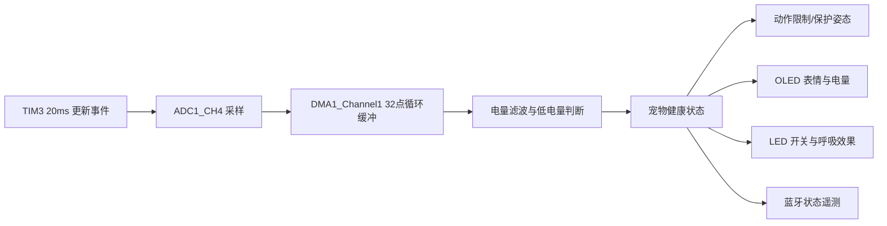
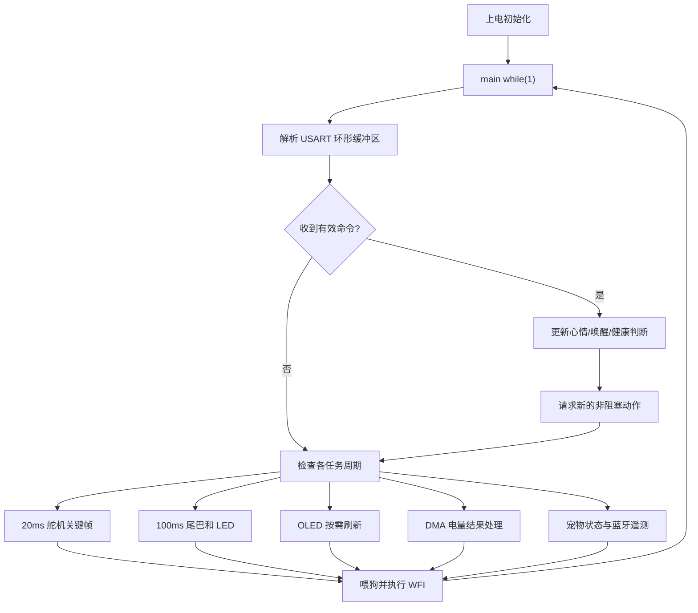
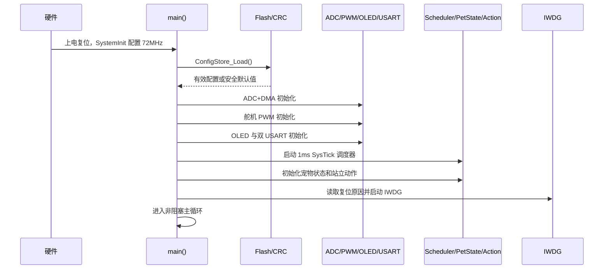
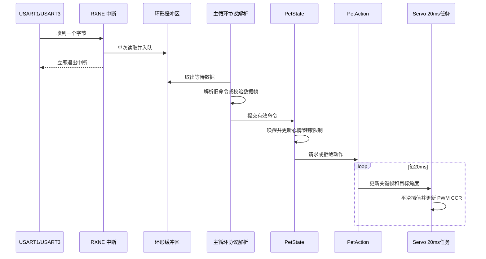
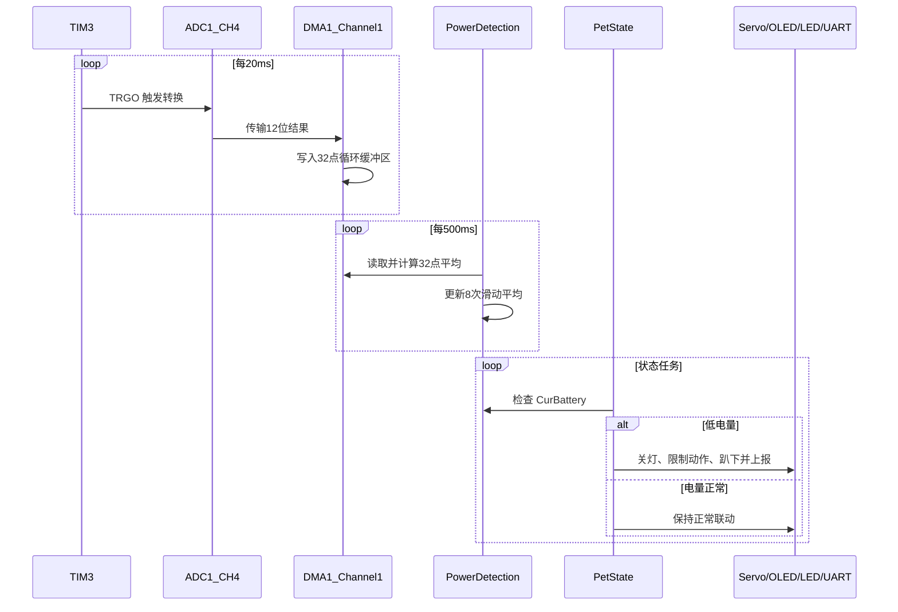

# 🐾 STM32 智能桌面宠物 (Smart Desktop Pet)

> 基于 STM32F103C8T6 的四足桌面电子宠物 —— 支持非阻塞动作、蓝牙/语音控制、OLED 表情、虚拟生命状态、电量保护和参数持久化

[](https://www.st.com/en/microcontrollers-microprocessors/stm32f103c8.html)
[](https://www.st.com/en/embedded-software/stm32-standard-peripheral-libraries.html)
[](https://www.keil.com/)
[](#软件架构)
[](#许可证)
[](https://oshwhub.com/sngelswyh)

---

## 📷 项目简介

这是一个基于 STM32F103C8T6 的开源四足桌面宠物机器人。硬件包含 4 个腿部舵机、1 个尾巴舵机、0.96 寸 OLED、两路 LED、蓝牙模块、语音模块和锂电池检测电路。

在原有遥控动作和表情显示的基础上，当前版本将动作系统升级为**非阻塞关键帧状态机**，并加入裸机任务调度、ADC+DMA、电量保护、宠物心情/精力/睡眠状态、Flash 参数保存、硬件 CRC 和独立看门狗。机器人执行长动作时仍能继续接收命令、刷新状态和采集电量。

详细的原版与新版差异见 [UPGRADE_GUIDE.md](UPGRADE_GUIDE.md)。

### 🌟 主要特性

- 🤖 **四足动作**：站立、坐下、趴下、前进、后退、左转、右转、跳跃、摇摆、招手和伸懒腰等
- 🧩 **非阻塞动作引擎**：关键帧每 20ms 更新，动作过程中可立即响应新命令
- 🎭 **7 种 OLED 表情**：睡觉、瞪眼、快乐、狂热、非常快乐、普通眼睛和打招呼
- 🐕 **虚拟宠物状态**：心情、精力、活跃度、睡眠和健康状态相互联动
- 📡 **双通道控制**：USART1 接语音模块，USART3 接蓝牙模块
- 📦 **兼容两种协议**：保留原单字节指令，同时支持带长度和校验和的数据帧
- 🦾 **舵机平滑与校准**：支持目标角度插值、最小/最大角度和零点微调
- 🔋 **ADC+DMA 电量检测**：TIM3 定时触发 ADC1，DMA 自动循环采样并进行两级平均
- 🛡️ **低电量保护**：自动关闭 LED、限制高耗能动作并进入保护姿态
- 💾 **掉电保存**：Flash 保存速度、灯光、宠物状态和舵机校准，硬件 CRC 校验
- ⏱️ **独立看门狗**：程序卡死时自动复位，并通过蓝牙上报复位标志
- 🌙 **空闲等待与睡眠**：CPU 空闲时执行 `WFI`，宠物睡眠后降低显示和遥测频率

---

## 🛠️ 硬件架构

### BOM（物料清单）

| 组件 | 型号/规格 | 数量 | 说明 |
|---|---|:---:|---|
| 主控 | STM32F103C8T6 | 1 | ARM Cortex-M3，72MHz，64KB Flash，20KB SRAM |
| 显示屏 | 0.96" OLED 128×64 | 1 | SSD1306，当前使用软件 I²C |
| 腿部舵机 | SG90 或同类 | 4 | TIM2 四通道 50Hz PWM |
| 尾巴舵机 | SG90 或同类 | 1 | TIM3_CH1 50Hz PWM |
| 蓝牙模块 | HC-05 / JDY-31 | 1 | USART3 串口透传 |
| 语音模块 | SU-03T 或同类 | 1 | 语音识别后通过 USART1 发送命令 |
| LED | 贴片 LED | 2 | TIM3_CH3/CH4 PWM 调光 |
| 电池 | 3.7V 锂电池 | 1 | 通过分压电路连接 ADC1_CH4 |

> 当前版本没有强制依赖 MPU6050 或外部 RTC 晶振，因此无需增加硬件即可运行。

### 舵机布局（俯视）

```text
                  前方
                   ↑
          ┌─────────────────┐
          │      头部       │
          │                 │
          │ Servo1  Servo2  │  前腿
          │ Servo3  Servo4  │  后腿
          │                 │
          │    Tail Servo   │
          └─────────────────┘
```

### 引脚映射

| 外设 | 引脚 | 外设资源 | 功能 |
|---|---|---|---|
| 舵机 1（左前腿） | PA0 | TIM2_CH1 | PWM 输出 |
| 舵机 2（右前腿） | PA1 | TIM2_CH2 | PWM 输出，软件反向映射 |
| 舵机 3（左后腿） | PA2 | TIM2_CH3 | PWM 输出 |
| 舵机 4（右后腿） | PA3 | TIM2_CH4 | PWM 输出，软件反向映射 |
| 尾巴舵机 | PA6 | TIM3_CH1 | PWM 输出 |
| LED1 | PB0 | TIM3_CH3 | PWM 调光 |
| LED2 | PB1 | TIM3_CH4 | PWM 调光 |
| OLED SCL | PB8 | 软件 I²C | 时钟线 |
| OLED SDA | PB9 | 软件 I²C | 数据线 |
| 语音模块 TX/RX | PA9 / PA10 | USART1 | 9600bps |
| 蓝牙模块 TX/RX | PB10 / PB11 | USART3 | 115200bps |
| 电池检测 | PA4 | ADC1_CH4 | 12 位 ADC 采样 |

### 外设联动关系



---

## 📁 项目结构

```text
桌面宠物代码/
├── User/
│   ├── main.c                 # 初始化与非阻塞任务调度主循环
│   ├── stm32f10x_conf.h       # 标准外设库配置
│   ├── stm32f10x_it.c         # Cortex-M3 异常处理
│   └── stm32f10x_it.h
├── HardWare/
│   ├── AD.c/h                 # ADC1 + DMA1 循环采样
│   ├── BlueTooth.c/h          # 双串口、环形缓冲、协议解析与遥测
│   ├── ConfigStore.c/h        # Flash 配置保存与硬件 CRC 校验
│   ├── Delay.c/h              # 保留的阻塞延时工具，动作主流程不再使用
│   ├── Face_Config.c/h        # 表情与电量的按需刷新
│   ├── Led_Breathing.c/h      # LED 常亮、呼吸和关闭逻辑
│   ├── OLED.c/h               # SSD1306 OLED 图形驱动
│   ├── OLED_Data.c/h          # 字模与表情图像数据
│   ├── PetAction.c/h          # 非阻塞关键帧动作状态机
│   ├── PetState.c/h           # 心情、精力、睡眠和健康联动
│   ├── PowerDetection.c/h     # DMA 数据换算与两级平均滤波
│   ├── PWM.c/h                # TIM2/TIM3 PWM 与 ADC 触发源
│   ├── Scheduler.c/h          # SysTick 1ms 时基与周期判断
│   ├── Servo.c/h              # 舵机插值、限位与零点微调
│   ├── Variable.c/h           # 兼容原项目的全局运行参数
│   └── Watchdog.c/h           # IWDG 初始化、喂狗和复位原因
├── Library/                    # STM32F10x 标准外设库 V3.5.0
├── Start/                      # CMSIS、系统时钟和启动文件
├── Objects/                    # Keil 编译输出
├── Project.uvprojx             # Keil MDK 工程
├── README.md                   # 项目总览与使用说明
└── UPGRADE_GUIDE.md            # 相比原版代码的详细改动
```

---

## 🧠 软件架构

### 裸机周期调度

项目没有引入 RTOS，而是使用 SysTick 建立 1ms 时基。主循环通过 `Scheduler_Elapsed()` 分周期运行任务：

| 周期 | 任务 | 说明 |
|---:|---|---|
| 持续执行 | `BlueTooth_Task()` | 从双串口环形缓冲区取数据并解析 |
| 20ms | `PetAction_Task20ms()` | 舵机插值和关键帧切换 |
| 100ms | `PetState_Task100ms()` | 尾巴行为联动 |
| 100ms | `LED_Breathing()` | LED 常亮、呼吸或关闭 |
| 200ms | `Face_Config()` | 清醒时检查 OLED 内容变化 |
| 500ms | `GetCur_Power()` | 更新滤波后的电量值 |
| 1000ms | `PetState_Task1s()` | 清醒时更新心情、精力和健康状态 |
| 1000ms | `BlueTooth_SendStatus()` | 清醒时发送蓝牙遥测 |
| 空闲 | `__WFI()` | 等待 SysTick 或串口等中断 |

宠物睡眠时，OLED 检查周期延长到 1000ms，状态更新和蓝牙遥测周期延长到 5000ms。

### 主循环数据流



### 非阻塞动作引擎

每个动作由若干关键帧组成，每帧包含 5 路舵机目标角度和持续时间：

```c
typedef struct
{
    uint8_t angle[SERVO_COUNT];
    uint16_t duration_ms;
} ActionFrame;
```

动作任务每 20ms 推进一次。收到新命令时直接替换当前动作，因此前进、摇摆、招手或伸懒腰过程中都能及时停止。原来的动作编号保持兼容，但运动轨迹由平滑插值生成，实机节奏可能与旧版略有差异。

---

## 🐕 宠物状态与行为

| 状态 | 范围/取值 | 影响 |
|---|---|---|
| 心情 `mood` | 0～100 | 互动时提高，长时间无人互动时下降 |
| 精力 `energy` | 0～100 | 运动时消耗，静止时恢复 |
| 活跃度 `activity` | 10～90 | 控制尾巴摆动速度 |
| 睡眠 `sleeping` | 0/1 | 自动趴下并降低非关键任务频率 |
| 健康 `health` | 正常/低电量/精力不足 | 限制高耗能动作并控制保护行为 |

### 联动规则

- 收到有效语音或蓝牙命令：唤醒宠物、提高心情并请求相应动作。
- 连续 120 秒没有互动：显示睡觉表情并进入放松趴下姿态。
- 执行移动类动作：逐步消耗精力并提高活跃度。
- 精力低于 `15`：拒绝向前跳、向后跳和剧烈摇摆。
- 电量值不高于 `15`：关闭 LED、中断高耗能动作并进入保护姿态。
- 心情不低于 `80` 且处于清醒空闲状态：显示快乐表情并允许自动摇尾。

> 当前电量值表示相对 3.0V 的百分之一伏增量，因此阈值 `15` 按现有公式约对应 3.15V。必须结合实际分压电阻和万用表读数校准。

---

## 🎮 控制协议

### 旧版单字节命令

USART1 和 USART3 均继续支持原有单字节命令：

| 指令 | 功能 | 表情/状态 | 备注 |
|:---:|---|---|---|
| `0x29` | 放松趴下 | 睡觉 | 可用于手动休息 |
| `0x30` | 坐下 | 瞪眼 | |
| `0x31` | 站立 | 普通眼睛 | 默认上电姿态 |
| `0x32` | 趴下 | 瞪眼 | |
| `0x33` | 前进 | 快乐 | 蓝牙通道支持持续执行 |
| `0x34` | 后退 | 快乐 | 蓝牙通道支持持续执行 |
| `0x35` | 左转 | 快乐 | 蓝牙通道支持持续执行 |
| `0x36` | 右转 | 快乐 | 蓝牙通道支持持续执行 |
| `0x37` | 全身摇摆 | 非常快乐 | 低电量或低精力时拒绝 |
| `0x38` | 调整移动速度 | 保持当前表情 | `200→180→...→100→200ms` 循环 |
| `0x39` | 调整摇摆延时 | 保持当前表情 | 到最小值后恢复为 9ms |
| `0x40` | 开关自动摇尾 | 保持当前表情 | 再次发送可关闭 |
| `0x41` | 向前跳 | 快乐 | 低电量或低精力时拒绝 |
| `0x42` | 向后跳 | 快乐 | 低电量或低精力时拒绝 |
| `0x43` | 打招呼 | Hello | 单次动作 |
| `0x44` | LED 全开 | — | |
| `0x45` | LED 关闭 | — | |
| `0x46` | 呼吸灯开启 | — | |
| `0x47` | 呼吸灯关闭 | — | |
| `0x48` | 伸懒腰 | Hello | 单次动作 |
| `0x49` | 后腿拉伸 | Hello | 单次动作 |
| `0x50` | 切换电量显示 | — | OLED 左上角叠加 |

### 双通道行为差异

| 特性 | 语音 USART1 | 蓝牙 USART3 |
|---|:---:|:---:|
| 波特率 | 9600bps | 115200bps |
| RX/TX | PA10 / PA9 | PB11 / PB10 |
| 移动动作 | 按配置次数执行 | 前进/后退/左右转持续执行 |
| 数据帧回复 | 不主动回复 | 返回确认帧与状态遥测 |

### 新版数据帧协议

```text
AA 55 CMD LEN DATA... CHECKSUM
```

- `AA 55`：帧头。
- `CMD`：命令字节。
- `LEN`：数据区长度，最大 16 字节。
- `DATA`：命令参数，可以为空。
- `CHECKSUM`：从 `AA` 到最后一个 `DATA` 字节累加和的低 8 位。
- 一个数据帧超过 100ms 仍未接收完整时会被丢弃。

新增命令：

| 命令 | 数据区 | 功能 |
|:---:|---|---|
| `0x60` | 无 | 立即查询状态 |
| `0x61` | 无 | 保存配置和宠物状态到 Flash |
| `0x62` | 无 | 紧急停止当前动作并站立 |
| `0x63` | `speed/10, swing_delay` | 设置移动速度和摇摆延时 |
| `0x64` | `servo, min, max, trim` | 设置舵机编号、最小角、最大角和有符号微调 |

查询状态示例：

```text
AA 55 60 00 5F
```

确认回复 `0x7F` 的 1 字节数据为 `1` 时表示成功，为 `0` 时表示命令被拒绝。

### 状态遥测 `0x70`

状态帧数据区固定为 14 字节：

| 偏移 | 字段 | 说明 |
|:---:|---|---|
| 0 | 电量 | 当前滤波结果 |
| 1 | 心情 | 0～100 |
| 2 | 精力 | 0～100 |
| 3 | 活跃度 | 10～90 |
| 4 | 动作 | 当前 `Action_Mode` |
| 5 | 健康 | 0 正常，1 低电量，2 精力不足 |
| 6 | 睡眠 | 0 清醒，1 睡眠 |
| 7～11 | 舵机目标角度 | 4 条腿和尾巴共 5 路 |
| 12 | 协议错误数 | 校验错误、超时和缓冲区溢出的低 8 位 |
| 13 | 看门狗复位标志 | 1 表示本次启动源于 IWDG 复位 |

---

## ⚙️ 技术细节

### 舵机与 PWM

- TIM2 和 TIM3 的 PWM 周期均为 20ms，即 50Hz。
- 基础角度映射为：`CCR = Angle / 180 × 2000 + 500`。
- 舵机 2、舵机 4 在软件中执行反向角度映射。
- 默认软件限位为 10°～170°，每路均可单独修改。
- 零点微调范围为 -30°～+30°。
- 校准只修改运行内存，发送 `0x61` 后才会写入 Flash。

### ADC 与 DMA

- ADC 输入：PA4 / ADC1_CH4。
- ADC 分辨率：12 位，结果范围 0～4095。
- TIM3 每 20ms 通过 TRGO 触发一次 ADC 转换。
- DMA1_Channel1 使用 32 个半字的循环缓冲区。
- 第一层滤波：32 点 DMA 缓冲平均。
- 第二层滤波：最近 8 次电量结果滑动平均。
- 电量处理任务每 500ms 运行一次。
- 当前换算公式：`(3.3 × 4 × ADC / 4095) × 100 - 300`。

### Flash 与硬件 CRC

- 配置页地址：`0x0800FC00`。
- 占用 STM32F103C8 64KB Flash 的最后一个 1KB 页面。
- 保存内容：速度、灯光、电量显示、心情、精力和 5 路舵机校准。
- 读取时检查配置魔数、参数范围和 STM32 CRC 外设计算结果。
- CRC 或参数无效时自动使用默认配置。
- Flash 有擦写寿命限制，请勿周期性发送 `0x61`。

> 应用代码不得增长到 `0x0800FC00` 及之后的地址。若未来固件接近 64KB，需要修改链接布局或更换配置存储页。

### 独立看门狗

- 使用 LSI 驱动 IWDG，不依赖主时钟。
- 分频系数为 64，重装值为 1250。
- 主循环正常运行时持续喂狗。
- 若主循环卡死，看门狗会复位 MCU。
- 启动时读取 `RCC_FLAG_IWDGRST`，并在状态帧中报告。

### OLED 与 LED

- OLED 使用 PB8/PB9 软件 I²C 和 1024 字节显存缓冲。
- 表情、电量或显示开关未变化时不重复发送整屏数据。
- 两路 LED 使用 TIM3_CH3/CH4 PWM。
- LED 支持常亮、呼吸和关闭；低电量保护会强制关闭 LED。

---

## ⏱️ 程序时序

### 上电初始化



### 串口到动作响应



### 电量采样与保护



---

## 🔧 软件开发

### 环境要求

- **IDE**：Keil MDK-ARM V5 或更高
- **编译器**：ARMCC V5（当前已验证 V5.06 update 6）
- **下载器**：ST-Link、J-Link 或 DAP-Link
- **库依赖**：STM32F10x Standard Peripheral Library V3.5.0，已包含在 `Library/`
- **RTOS**：不需要，当前使用裸机调度器

### 编译与烧录

1. 使用 Keil MDK 打开 `Project.uvprojx`。
2. 选择目标 `STM32F103C8`。
3. 按 `F7` 编译工程。
4. 使用下载器连接 SWD 接口。
5. 按 `F8` 下载到开发板。

生成的固件位于：

```text
Objects/Project.hex
```

最近一次完整构建结果：

```text
Program Size: Code=13726 RO-data=10210 RW-data=188 ZI-data=2972
0 Error(s), 0 Warning(s)
```

### 常用配置位置

| 配置 | 文件/接口 | 默认值 |
|---|---|---|
| 移动动作重复次数 | `Variable.h` 中的 `Chongfunumber` | 2 |
| 摇摆重复次数 | `Variable.h` 中的 `SwingRepeatnumber` | 3 |
| 招手重复次数 | `Variable.h` 中的 `HelloRepeatnumber` | 4 |
| 移动帧时间 | `SpeedDelay` 或协议 `0x63` | 200ms |
| 摇摆延时参数 | `SwingDelay` 或协议 `0x63` | 6ms |
| 自动睡眠时间 | `PetState.c` 中的 `SLEEP_TIMEOUT_MS` | 120000ms |
| 低电量阈值 | `PetState.c` 中的 `LOW_BATTERY_LEVEL` | 15 |
| 低精力阈值 | `PetState.c` 中的 `LOW_ENERGY_LEVEL` | 15 |
| 舵机校准 | 协议 `0x64` | 10°～170°，微调 0° |

---

## ✅ 实机测试建议

1. 第一次烧录时将机器人架空，避免未知舵机方向导致跌落。
2. 分别确认 5 路舵机的方向、中心角和机械限位。
3. 使用万用表校准电池换算值，再决定是否调整低电量阈值。
4. 在前进、转向、摇摆和伸懒腰过程中发送 `0x62`，确认动作能够立即停止。
5. 分别测试 USART1 单次运动和 USART3 持续运动。
6. 发送半包、错误长度和错误校验和的数据帧，确认不会误动作。
7. 修改速度、灯光或舵机校准后发送 `0x61`，断电重启并检查恢复结果。
8. 连续 120 秒不发送命令，检查自动睡眠和再次唤醒。
9. 在调试固件中停止喂狗，检查复位后状态帧的看门狗标志。
10. 连续运行数小时，观察串口、OLED、舵机、ADC 和 LED 是否稳定。

---

## 🚧 暂未启用

- **MPU6050 姿态模块**：现有硬件信息无法确认已安装，因此当前没有初始化 I²C 传感器。
- **真实 RTC 日历**：无法确认板上存在 32.768kHz LSE 晶振，当前只记录软件运行时间。
- **RTOS**：当前刻意使用裸机调度，以便学习 SysTick、中断、DMA 和状态机之间的配合。

---

## 🙏 致谢与鸣谢

- **原项目作者**：[Sngels_wyh](https://oshwhub.com/sngelswyh)
- **OLED 驱动**：基于 [江协科技](https://jiangxiekeji.com/) 的 OLED 图形库
- **STM32 标准库**：[STMicroelectronics](https://www.st.com/) STM32F10x Standard Peripheral Library V3.5.0
- **开源平台**：[立创开源硬件平台](https://oshwhub.com/sngelswyh/stm32-smart-desktop-pet)

---

## 📄 许可证

```text
本程序由 Sngels_wyh 创建并免费开源共享。
你可以任意查看、使用和修改，并应用到自己的项目之中。
```

本项目完全开源，可自由使用、修改和分发。如用于二次开发或分享，请注明原作者。

---

## 🔗 相关链接

| 平台 | 链接 |
|---|---|
| 📐 **立创开源（原理图与 PCB）** | [oshwhub.com/sngelswyh](https://oshwhub.com/sngelswyh/stm32-smart-desktop-pet) |
| 📝 **CSDN** | 搜索 `Sngels_wyh` |
| 🎬 **Bilibili** | 搜索 `智能桌面宠物 STM32` |
| 🎵 **抖音** | 搜索 `智能桌面宠物` |

---

> 🐱 如果觉得这个项目有趣，请给个 ⭐ Star！欢迎继续完善动作、表情和外设联动。
